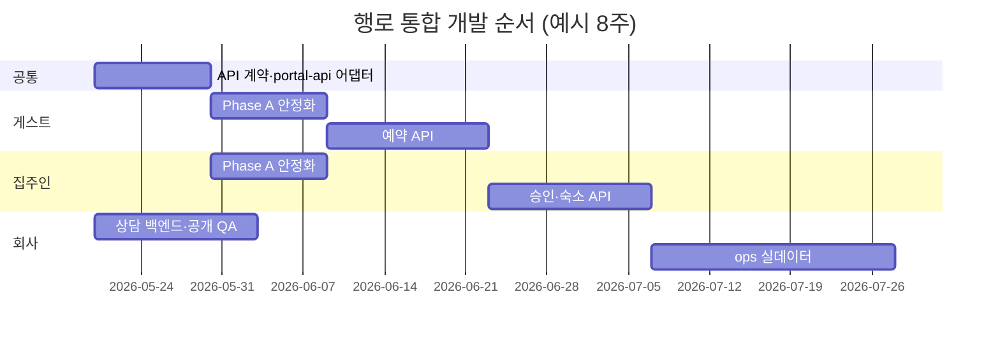

# 행로 — 플로우별 개발 액션 플랜

게이트(`index.html`)에서 선택하는 **3개 플로우** 기준입니다.

| 플로우 | 경로 | 주 사용자 |
| --- | --- | --- |
| **1. 게스트** | `/guest/` | 머무는 분 (검색·예약·여행) |
| **2. 집주인** | `/host/` | 공간 제공자 (숙소·예약·문의) |
| **3. 회사** | `/company/` + `/company/ops/` | 방문자·파트너 + 운영팀 |

공통 전제: 현재는 **정적 데모** (`portal-data.js` 목업 + `localStorage`). 실서비스 전환 시 `demo/server.py` 또는 BaaS/API로 데이터 계층만 교체하는 전략을 권장합니다.

---

## 공통 기반 (3플로우 선행·병행)

| 우선순위 | 액션 | 산출물 | 비고 |
| --- | --- | --- | --- |
| P0 | API 계약 초안 | `docs/API.md` (REST 또는 Supabase 스키마) | Property, Booking, Message, Inquiry 엔티티 |
| P0 | `PORTAL_DATA` 어댑터 분리 | `js/portal-api.js` — fetch 래퍼, 실패 시 목업 폴백 | 기존 `getProperty` 시그니처 유지 |
| P1 | E2E 스모크 | `demo/smoke-test.sh` 확장 (guest 예약 → host 승인) | CI optional |
| P1 | CSS 캐시·버전 통일 | `?v=` 일괄 bump 스크립트 | company v14, guest v12 등 혼재 |
| P2 | 접근성 패스 | focus, aria-current, 폼 label | DESIGN.md §10 |

---

# 플로우 1 — 게스트 (`/guest/`)

## 현재 상태 (As-Is)

- 페이지: `index`, `listing`, `checkout`, `bookings`, `booking`, `stay`, `messages`
- 렌더: `guest-app.js` + `GuestApp.autoBoot()` / `data-ga-page`
- 데이터: `PORTAL_DATA.listBookable()`, 예약은 `localStorage` `hangro_guest_trips`
- UI: `guest-airbnb.css`, 검색·위젯·후기 블록 동작
- 연동: 집주인 승인 시 `hangro_host_booking_status`로 trip 상태 반영

## 목표 (To-Be)

머무는 분이 **검색 → 상세 → 예약 → 여행 관리 → 호스트 문의**까지 끊김 없이 완료하고, 실제 결제·확정 알림까지 확장 가능한 구조.

## Phase A — 안정화 (1~2주)

| # | 액션 | 완료 기준 |
| --- | --- | --- |
| A1 | 검색·날짜 유효성 | 체크아웃 ≤ 체크인 방지, 과거 날짜 경고 |
| A2 | 예약 위젯 QA | 모바일 320px에서 overflow 없음 (`ga-widget`) |
| A3 | trip 상태 UI 통일 | pending/confirmed/rejected 라벨·색 `PortalUI.statusBadge` 단일화 |
| A4 | 빈 상태·에러 카피 | 데이터 없음·로드 실패 시 행로 톤 문구 |
| A5 | `stay.html` / `booking.html` 역할 문서화 | CODEBASE에 URL·파라미터 표 추가 |

## Phase B — 기능 확장 (2~4주)

| # | 액션 | 완료 기준 |
| --- | --- | --- |
| B1 | 예약 API 연동 | checkout submit → POST `/api/bookings`, id 서버 발급 |
| B2 | 가용성(캘린더) | listing에서 이미 예약된 날짜 비활성 (host 캘린더 데이터 공유) |
| B3 | 메시지 스레드 | propertyId·bookingId 기준 대화 목록 (단방향 → 왕복) |
| B4 | 결제 UI 스텁 | “데모: 결제 생략” → Stripe/토스 연동 포인트만 HTML 슬롯 |
| B5 | SEO·OG | listing 메타 description, `og:image` (첫 사진) |

## Phase C — 프로덕션 (4주+)

| # | 액션 | 완료 기준 |
| --- | --- | --- |
| C1 | 인증 | 게스트 로그인(이메일/소셜), trip 소유권 검증 |
| C2 | 알림 | 예약 확정/거절 이메일 또는 카카오 알림톡 |
| C3 | 리뷰 작성 | 체류 완료 후 `reviews` POST |
| C4 | i18n 준비 | 카피 키 분리 또는 `lang` 속성 확장 |

## 의존성

- **집주인 B1** (승인 API) 완료 전까지 게스트 예약은 “요청” 상태만 서버 저장
- **회사** `places.json` 숙소와 `portal-data` 숙소 id 매핑 정책 결정 (home-1 ↔ 실제 장소)

## 성공 지표

- 데모 시나리오 5분 내: 검색 → 예약 → host 승인 → 게스트 trip “확정” 확인
- Lighthouse 모바일 Performance ≥ 85 (이미지 lazy)

---

# 플로우 2 — 집주인 (`/host/`)

## 현재 상태 (As-Is)

- 페이지: `index`(대시보드), `bookings`, `properties`, `property-edit`, `messages`
- 렌더: `host-app.js` + `data-ha-page`
- 기능: 예약 승인/거절, 월별 캘린더, 숙소 편집(일부 `localStorage` `PROPERTY_EDITS_KEY`)
- 잠금: `portal-guard.js` — 게스트와 동시 체험 시 리다이렉트

## 목표 (To-Be)

집주인이 **한 화면에서 오늘 할 일(승인·문의)**을 보고, 숙소 정보·가용 일정을 스스로 관리.

## Phase A — 안정화 (1~2주)

| # | 액션 | 완료 기준 |
| --- | --- | --- |
| A1 | `data-ha-page` vs 코드 `data-host-page` 문서 정합 | CODEBASE·HTML 속성명 통일 (현재 `data-ha-page` 사용 중) |
| A2 | property-edit 저장 피드백 | 저장 성공/실패 토스트, 미리보기 링크 |
| A3 | 캘린더 ↔ bookings 연동 | 날짜 클릭 시 해당 일 예약 필터 |
| A4 | 다중 숙소 집주인 | host-b 등 demoHostId 전환 UI (데모용 셀렉트) |
| A5 | 승인/거절 확인 모달 | 실수 방지 confirm |

## Phase B — 기능 확장 (2~4주)

| # | 액션 | 완료 기준 |
| --- | --- | --- |
| B1 | 예약 API | PATCH booking status, 게스트 trip 자동 동기화(서버 주도) |
| B2 | 숙소 CRUD API | create/pause 숙소, 사진 업로드(S3/Cloudinary) |
| B3 | 가격·최소 숙박일 | property-edit에 요일별 가격·min nights |
| B4 | 문의함 실시간(선택) | 폴링 또는 SSE로 새 메시지 배지 |
| B5 | 대시보드 KPI | 이번 달 매출·점유율 (목업 → 집계 API) |

## Phase C — 프로덕션 (4주+)

| # | 액션 | 완료 기준 |
| --- | --- | --- |
| C1 | 집주인 온보딩 | 첫 숙소 등록 위저드 3단계 |
| C2 | 정산·수수료 | 행로 수수료 % 표시, 정산 예정일 |
| C3 | 역할·권한 | co-host 초대, 읽기 전용 매니저 |
| C4 | 감사 로그 | 승인/거절·가격 변경 이력 (ops에서 조회) |

## 의존성

- 게스트 **B1** 예약 생성 API
- 회사 ops **B2**에서 전체 숙소 목록·강제 pause

## 성공 지표

- 승인 대기 → 확정까지 3클릭 이내
- property-edit 저장 후 게스트 listing에 1분 내 반영(캐시 무효화)

---

# 플로우 3 — 회사 (`/company/` + `/company/ops/`)

회사 플로우는 **공개(마케팅·신뢰)** 와 **운영(ops)** 두 층으로 나눕니다.

## 현재 상태 (As-Is)

**공개**

- `index`, `map-demo`, `archive`, `place-detail`, `team`, `booking`(상담 폼)
- 스타일: `styles-editorial.css` + `company-unified.css`
- 데이터: `places-runtime.js` + `data/places.json` (지도·기록·상세)
- 상담 폼: 클라이언트만 성공 메시지 (서버 미전송)

**운영 (ops)**

- `ops/index`(로그인), `dashboard`, `guests`, `hosts`, `properties`, `bookings`, `messages`
- `company-ops-guard.js` (ops / hangro2026), `company-ops-app.js`
- `company/` 루트의 `dashboard.html` 등 — ops와 중복 가능성 → 정리 필요

## 목표 (To-Be)

방문자는 **브랜드·사례·지도·상담**으로 신뢰를 얻고, 운영팀은 **전체 예약·숙소·문의**를 한곳에서 관리.

## Phase A — 공개 사이트 안정화 (1~2주)

| # | 액션 | 완료 기준 |
| --- | --- | --- |
| A1 | 상담 폼 백엔드 | Formspree / Google Sheet / `/api/inquiries` POST + 스팸 방지 |
| A2 | 푸터·네비 일관성 | `footer-rich` 3열, Sitemap 빈 항목 없음 (완료 유지) |
| A3 | 지도·상세 QA | GitHub Pages에서 `places.json` 200, 핀 클릭 → place-detail |
| A4 | 아카이브 콘텐츠 | `places.json` 스토리 2곳 이상, 이미지 경로 검증 스크립트 |
| A5 | 레거시 URL | 루트 `booking.html` 등 리다이렉트 유지·문서화 |

## Phase B — 공개 확장 (2~3주)

| # | 액션 | 완료 기준 |
| --- | --- | --- |
| B1 | 상담 → CRM | Notion/Airtable webhook, 담당자 알림 |
| B2 | 게스트 숙소와 브릿지 | company 소개 카드 → `/guest/listing?id=home-1` CTA |
| B3 | `content.html` 활용 | 공지·보도자료 섹션 or 삭제 결정 |
| B4 | 성능 | `Asset/` WebP, lazy load, LCP &lt; 2.5s |
| B5 | 다국어 랜딩(선택) | EN 요약 페이지 1장 |

## Phase C — ops 운영 도구 (2~4주)

| # | 액션 | 완료 기준 |
| --- | --- | --- |
| C1 | 인증 강화 | 데모 비밀번호 → 환경변수·세션 만료·HTTPS only |
| C2 | ops ↔ API | dashboard KPI 실데이터, bookings 테이블 필터·정렬 |
| C3 | 게스트/집주인 상세 | ops에서 trip·메시지 타임라인 drill-down |
| C4 | 상담 인박스 | `booking.html` 제출 건 ops 목록 표시 |
| C5 | 중복 페이지 정리 | `company/dashboard.html` vs `ops/dashboard.html` 단일화 |

## Phase D — 프로덕션 (4주+)

| # | 액션 | 완료 기준 |
| --- | --- | --- |
| D1 | RBAC | ops 역할(읽기/쓰기/관리자) |
| D2 | 감사·백업 | 예약·상담 데이터 일별 export |
| D3 | 분석 | Plausible/GA4, 전환(상담·게스트 진입) |

## 의존성

- 게스트·집주인 API가 있어야 ops **C2~C4**가 실데이터
- `places.json` 스키마 변경 시 `places-runtime` 검증 테스트 필수

## 성공 지표

- 상담 제출 → ops 또는 이메일 1분 내 도달
- 지도·아카이브·팀·상담 4페이지 모바일 레이아웃 깨짐 0건

---

## 플로우 간 통합 로드맵 (권장 순서)

**추천 스프린트 순서**

1. **Sprint 1**: 공통 API 계약 + 회사 상담 백엔드 + 게스트/집주인 Phase A QA — ✅ 구현됨 (`docs/API.md`, `portal-api.js`, 상담 POST, 날짜 검증, 승인 confirm, 캘린더 필터)  
2. **Sprint 2**: 게스트 예약 API + 집주인 승인 API (E2E 연결) — ✅ `demo/server.py` + `PortalAPI` + checkout 예약  
3. **Sprint 3**: 집주인 숙소 편집 API + ops 대시보드 실데이터 — ✅ `PATCH /api/properties`, ops 상담·예약 테이블  
4. **Sprint 4**: 알림 — ✅ `HangroNotify` 토스트  
5. **Sprint 5**: 결제 — ✅ 결제하기 버튼 → 알림만, 이후 예약 요청  

**데모 서버 (API 전체):** `python3 demo/server.py` → http://127.0.0.1:9090/  
정적만: `python3 -m http.server 8080` → API는 localStorage 폴백  

---

## 리스크 & 제약

| 리스크 | 대응 |
| --- | --- |
| `localStorage`와 서버 데이터 불일치 | API 전환 시 마이그레이션 배너 + 1회 clear 안내 |
| `places.json` vs `portal-data` 이중 데이터 | `home-*` id 맵 테이블 또는 단일 Property 서비스 |
| GitHub Pages 정적 한계 | API는 serverless(Vercel/Cloudflare) 또는 `demo/server.py` 호스팅 |
| `.cursorrules` 진입점 변경 | `autoBoot`, `HAENG_RUNTIME.init*` 시그니처 유지 |

---

## 다음에 할 일 (이번 주 Top 5)

1. **회사**: `booking.html` 상담 POST 연동 (Formspree 등 30분 작업)  
2. **공통**: `docs/API.md` 엔티티 1페이지 초안  
3. **게스트**: 날짜 유효성 + 모바일 위젯 최종 QA  
4. **집주인**: 승인 confirm 모달 + 캘린더→예약 필터  
5. **회사 ops**: `company/dashboard.html` 등 중복 파일 정리 여부 결정  

문서 위치: `docs/DEVELOPMENT_PLANS.md` — 플로우별 진행 시 체크박스로 갱신하세요.
